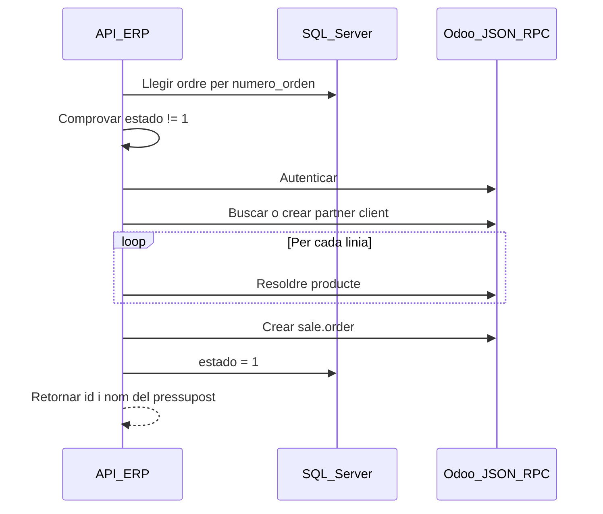

# Documentació tècnica — API de connexió ERP

> **Document 3 de 4** · API ERP  
> Projecte: `API_Connecio_ERP`  
> URL base: `http://localhost:5100`  
> Swagger: `http://localhost:5100/swagger`

---

## Índex

1. [Visió general](#1-visió-general)
2. [Configuració](#2-configuració)
3. [Endpoints](#3-endpoints)
4. [Flux intern (Odoo)](#4-flux-intern-odoo)
5. [Camp estado](#5-camp-estado)
6. [Errors](#6-errors)
7. [Arquitectura interna](#7-arquitectura-interna)

---

## 1. Visió general

Aquesta API connecta **SQL Server** (ordres guardades per l'API OCR) amb **Odoo 17** (pressupostos de venda).

Responsabilitats:

- Llistar ordres **pendents** de traspassar (`estado = 0`).
- Crear un pressupost (`sale.order`) a Odoo a partir del número d'ordre.
- Marcar l'ordre com a traspassada (`estado = 1`).

**Tecnologies:** .NET 9, Minimal APIs, ADO.NET, JSON-RPC cap a Odoo.

---

## 2. Configuració

Fitxer: `API_Connecio_ERP/appsettings.json`

| Clau | Descripció | Exemple |
|------|------------|---------|
| `ConnectionStrings:DefaultConnection` | SQL Server (mateixa BD que API OCR) | — |
| `Odoo:BaseUrl` | URL d'Odoo | `http://localhost:8069` |
| `Odoo:Database` | Nom de la base de dades Odoo | `odoo-projecte` |
| `Odoo:Username` | Usuari Odoo | `admin` |
| `Odoo:Password` | Contrasenya | — |
| `Odoo:DefaultProductCode` | Referència interna producte genèric | `SERVICIO` |

**CORS:** `AllowAll` (desenvolupament).

---

## 3. Endpoints

### Resum

| Mètode | Ruta | Descripció |
|--------|------|------------|
| GET | `/erp/ordenes` | Llista resum d'ordres pendents |
| POST | `/erp/presupuesto` | Crea pressupost a Odoo |

---

### GET `/erp/ordenes`

Retorna les ordres amb **`estado = 0`** (pendents de traspassar a Odoo).

**Petició:** sense cos.

**Resposta 200 OK:** array d'objectes `OrdenResumenResponse`.

```json
[
  {
    "id": "3fa85f64-5717-4562-b3fc-2c963f66afa6",
    "numero": "PO-2024-100",
    "fecha": "2024-03-15T00:00:00",
    "cliente_nombre": "Empresa Client SL",
    "moneda": "EUR",
    "total_ttc": 363.00,
    "lineas": 3
  }
]
```

| Camp | Tipus | Descripció |
|------|-------|------------|
| `id` | `guid` | Identificador de l'ordre a SQL |
| `numero` | `string` | Número d'ordre (clau per crear pressupost) |
| `fecha` | `datetime` | Data de l'ordre |
| `cliente_nombre` | `string` | Nom del client |
| `moneda` | `string` | Moneda (p. ex. EUR) |
| `total_ttc` | `decimal` | Total amb IVA |
| `lineas` | `int` | Nombre de línies |

**Resposta 400:**

```json
{
  "error": "VAL_ERROR",
  "message": "Descripció de l'error"
}
```

**Array buit `[]`:** no hi ha ordres pendents.

---

### POST `/erp/presupuesto`

Crea un pressupost de venda a Odoo per al número d'ordre indicat.

**Cos (application/json):**

```json
{
  "numero_orden": "PO-2024-100"
}
```

| Camp JSON | Tipus | Obligatori | Descripció |
|-----------|-------|------------|------------|
| `numero_orden` | `string` | Sí | Valor del camp `orden.numero` guardat a SQL |

**Resposta 200 OK:**

```json
{
  "message": "Presupuesto creado correctamente en Odoo.",
  "odoo_sale_order_id": 42,
  "odoo_sale_order_name": "S00042"
}
```

| Camp | Tipus | Descripció |
|------|-------|------------|
| `message` | `string` | Missatge d'èxit |
| `odoo_sale_order_id` | `int` | ID intern del `sale.order` a Odoo |
| `odoo_sale_order_name` | `string` | Referència visible (p. ex. S00042) |

**Resposta 400:**

```json
{
  "error": "VAL_ERROR",
  "message": "Esta orden ya está traspasada a Odoo."
}
```

Altres missatges possibles (exemples):

- Ordre no trobada a SQL.
- Error d'autenticació o connexió amb Odoo.
- Producte no trobat a Odoo per a alguna línia.

---

## 4. Flux intern (Odoo)

Quan es rep `POST /erp/presupuesto`, `PresupuestoBusiness` executa aproximadament:



### Resolució de producte (per línia)

Ordre de cerca a Odoo:

1. `codigo_cliente` de la línia  
2. `codigo_proveedor` de la línia  
3. Producte amb referència interna `SERVICIO` (`Odoo:DefaultProductCode`)  
4. Nom exacte de la `descripcion`

### Entitat Odoo

- Model: **`sale.order`** (pressupost / comanda de venda en estat esborrany o confirmat segons configuració Odoo).

---

## 5. Camp `estado`

| Valor | Significat |
|-------|------------|
| `0` | Ordre guardada, **pendent** de crear pressupost a Odoo |
| `1` | Ordre **ja traspassada**; no apareix a `GET /erp/ordenes` |

Després d'un `POST /erp/presupuesto` correcte, l'API actualitza `estado` a `1`.

---

## 6. Errors

| HTTP | Causa habitual |
|------|----------------|
| 200 | Èxit |
| 400 | Validació, ordre ja traspassada, error Odoo exposat com a `VAL_ERROR` |

Format d'error:

```json
{
  "error": "VAL_ERROR",
  "message": "Text explicatiu"
}
```

---

## 7. Arquitectura interna

```
Application/Endpoints/PresupuestoEndpoints.cs
Business/PresupuestoBusiness.cs
Infrastructure/DTO/Presupuestos/     → PresupuestoRequest, PresupuestoResponse, OrdenResumenResponse
Infrastructure/Integrations/Odoo/  → OdooClient (JSON-RPC)
Infrastructure/Persistence/          → PresupuestosADO, consultes SQL
Services/DatabaseConnection.cs
```

**Odoo en local:** `odoo-projecte/docker-compose.yml` — port **8069**.

**Enllaços:** [Plantejament](../General/03_Plantejament.md) · [API OCR](../API_Extraccio/Documentacio_Tecnica.md) · [Frontend](../Frontend/Documentacio_Tecnica.md)
