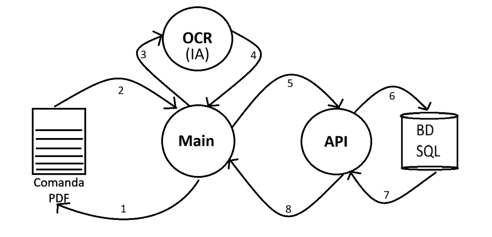

```
1 - Inici del procés d’extracció.
2 - S’indiquen quines comandes es volen processar.
3 - S’envien les comandes a un OCR (IA).
4 - Retorna un JSON amb la informació extreta.
5 - S’envien els JSON a l’API.
6 - L’API valida les dades.
  - L’API insereix les dades a la base de dades.
7 - La base de dades retorna una resposta a l’API.
8 - L’API retorna una resposta al main.
```