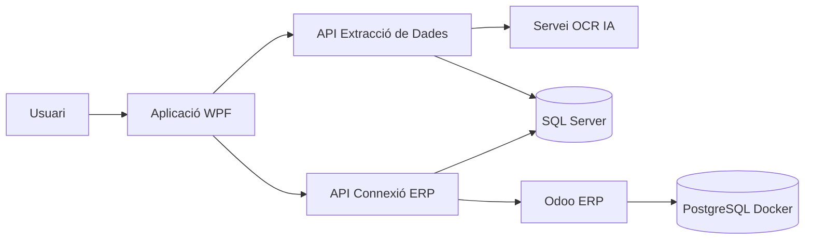
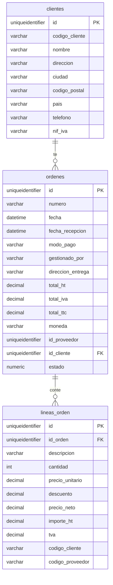
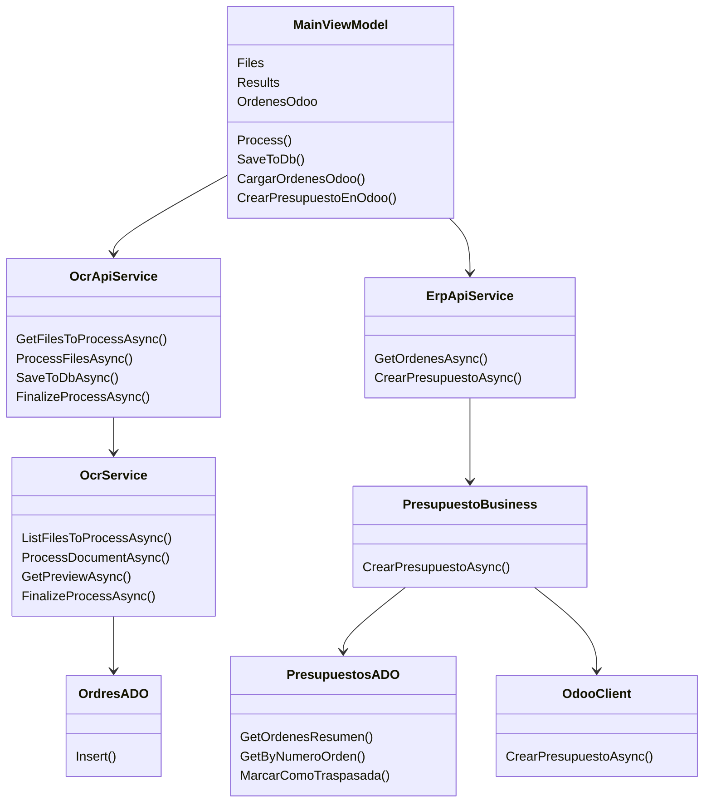

# Documentació del Projecte Final

## Índex

1. [Introducció](#introducció)
2. [Objectius](#objectius)
3. [Cos](#cos)
   - [Problemàtica](#problemàtica)
   - [Per què es crea el software](#per-què-es-crea-el-software)
   - [Què és un OCR](#què-és-un-ocr)
   - [Què és Navision](#què-és-navision)
   - [Estructura de la base de dades](#estructura-de-la-base-de-dades)
   - [Estructura de les APIs](#estructura-de-les-apis)
   - [Estructura del frontend](#estructura-del-frontend)
   - [Estructura d'Odoo](#estructura-dodoo)
   - [Productes a Odoo](#productes-a-odoo)
   - [Flux complet del sistema](#flux-complet-del-sistema)
4. [Planificació temporal del projecte](#planificació-temporal-del-projecte)
5. [Requisits funcionals i no funcionals](#requisits-funcionals-i-no-funcionals)
6. [Casos d'ús](#casos-dús)
7. [Diagrama d'arquitectura](#diagrama-darquitectura)
8. [Diagrama entitat-relació](#diagrama-entitat-relació)
9. [Diagrama de classes](#diagrama-de-classes)
10. [Captures de pantalla de la interfície](#captures-de-pantalla-de-la-interfície)
11. [Proves realitzades](#proves-realitzades)
12. [Manual d'usuari](#manual-dusuari)
13. [Manual tècnic](#manual-tècnic)
14. [Com fer la instal·lació](#com-fer-la-installació)
   - [Requisits previs](#requisits-previs)
   - [Preparar la base de dades](#preparar-la-base-de-dades)
   - [Configurar les APIs](#configurar-les-apis)
   - [Arrencar Odoo](#arrencar-odoo)
   - [Arrencar l'API OCR](#arrencar-lapi-ocr)
   - [Arrencar l'API ERP](#arrencar-lapi-erp)
   - [Arrencar el frontend](#arrencar-el-frontend)
   - [Provar el funcionament](#provar-el-funcionament)
15. [Conclusions](#conclusions)
16. [Punts que podrien faltar](#punts-que-podrien-faltar)

## Introducció

Aquest projecte final de DAM consisteix en el desenvolupament d'una aplicació per automatitzar el procés de lectura, validació, emmagatzematge i traspàs d'ordres de compra cap a un sistema ERP.

El sistema parteix d'un document PDF, normalment una ordre de compra, i utilitza un servei OCR basat en intel·ligència artificial per extreure'n la informació principal. Les dades extretes es mostren a una aplicació d'escriptori, on l'usuari pot revisar-les abans de guardar-les a una base de dades SQL Server.

Una vegada les ordres estan guardades, el sistema permet enviar-les a Odoo per crear pressupostos de venda. Per evitar duplicats, cada ordre té un camp d'estat que indica si encara està pendent o si ja ha estat traspassada a l'ERP.

El projecte està dividit en diferents parts:

- Una aplicació WPF d'escriptori.
- Una API d'extracció de dades i OCR.
- Una API de connexió amb l'ERP.
- Una base de dades SQL Server.
- Un entorn Odoo executat amb Docker.

## Objectius

Els objectius principals del projecte són:

- Automatitzar la lectura d'ordres de compra en format PDF.
- Reduir la introducció manual de dades.
- Permetre la revisió de les dades abans de guardar-les.
- Guardar la informació estructurada en una base de dades relacional.
- Connectar el sistema amb Odoo per crear pressupostos.
- Evitar que una mateixa ordre es traspassi més d'una vegada.
- Separar responsabilitats entre interfície, APIs, lògica de negoci i persistència.
- Crear una eina funcional, pràctica i propera a un cas real d'empresa.

## Cos

### Problemàtica

En moltes empreses, les ordres de compra arriben en format PDF o en documents no estructurats. Això fa que una persona hagi de llegir el document manualment i copiar les dades a un sistema intern o ERP.

Aquest procés presenta diversos problemes:

- Consumeix temps.
- Pot provocar errors humans.
- Dificulta el seguiment de l'estat de cada ordre.
- Obliga a repetir informació entre sistemes diferents.
- No escala bé quan augmenta el volum de documents.

El projecte intenta resoldre aquesta problemàtica mitjançant una aplicació que llegeix el PDF, extreu les dades, permet revisar-les i les traspassa posteriorment a Odoo.

### Per què es crea el software

El software es crea per tenir un flux complet de treball entre documents rebuts i gestió empresarial.

El procés que cobreix és:

1. L'usuari deixa un PDF a la carpeta de documents pendents.
2. L'aplicació detecta el document.
3. L'usuari selecciona el document i el processa.
4. L'API OCR envia el PDF a un model d'intel·ligència artificial.
5. El model retorna un JSON amb les dades extretes.
6. L'usuari revisa i corregeix les dades si cal.
7. Les dades es guarden a SQL Server.
8. L'ordre queda pendent de traspàs a Odoo.
9. Des de la pestanya Odoo, l'usuari selecciona una ordre pendent.
10. L'API ERP crea un pressupost a Odoo.
11. L'ordre queda marcada com a traspassada.

Amb això s'aconsegueix una eina que redueix feina manual i centralitza el control del procés.

### Què és un OCR

OCR vol dir Optical Character Recognition, o reconeixement òptic de caràcters.

Un OCR és una tecnologia que permet convertir text present en imatges o documents escanejats en dades digitals que un programa pot llegir i processar.

En aquest projecte, l'OCR no només extreu text pla del PDF, sinó que s'utilitza juntament amb un model d'intel·ligència artificial per interpretar el contingut de l'ordre de compra i retornar-lo en format JSON.

Exemples de dades extretes:

- Nom del client.
- NIF o IVA.
- Número d'ordre.
- Data de l'ordre.
- Línies de producte.
- Quantitats.
- Preus.
- Imports totals.
- Moneda.

### Què és Navision

Navision és el nom amb què es coneixia Microsoft Dynamics NAV, un sistema ERP utilitzat per gestionar processos empresarials com vendes, compres, inventari, comptabilitat i facturació.

Un ERP és una eina que centralitza la informació de l'empresa i permet gestionar diferents àrees des d'un mateix sistema.

En aquest projecte no s'integra directament amb Navision. El sistema ERP utilitzat és Odoo. Tot i això, la idea funcional és semblant: traspassar ordres processades automàticament cap a un ERP perquè es puguin gestionar dins del sistema empresarial.

### Estructura de la base de dades

La base de dades utilitzada és SQL Server. La seva funció és guardar la informació extreta dels documents i servir com a punt intermedi abans d'enviar les ordres a Odoo.

Les taules principals són:

#### Taula `clientes`

Guarda la informació del client associat a una ordre.

Camps principals:

- `id`: identificador únic del client.
- `codigo_cliente`: codi intern del client.
- `nombre`: nom del client.
- `direccion`: adreça.
- `ciudad`: ciutat.
- `codigo_postal`: codi postal.
- `pais`: país.
- `telefono`: telèfon.
- `nif_iva`: identificador fiscal.

#### Taula `ordenes`

Guarda la capçalera de l'ordre de compra.

Camps principals:

- `id`: identificador únic de l'ordre.
- `numero`: número de l'ordre.
- `fecha`: data de l'ordre.
- `fecha_recepcion`: data de recepció.
- `modo_pago`: forma de pagament.
- `gestionado_por`: persona o sistema que gestiona l'ordre.
- `direccion_entrega`: adreça d'entrega.
- `total_ht`: total sense impostos.
- `total_iva`: import d'IVA.
- `total_ttc`: total amb impostos.
- `moneda`: moneda de l'ordre.
- `id_proveedor`: identificador del proveïdor.
- `id_cliente`: identificador del client.
- `estado`: estat de traspàs cap a Odoo.

El camp `estado` funciona així:

- `0`: ordre pendent de traspassar.
- `1`: ordre ja traspassada a Odoo.

#### Taula `lineas_orden`

Guarda les línies de producte o servei de cada ordre.

Camps principals:

- `id`: identificador únic de la línia.
- `id_orden`: ordre a la qual pertany.
- `descripcion`: descripció del producte.
- `cantidad`: quantitat.
- `precio_unitario`: preu unitari.
- `descuento`: descompte.
- `precio_neto`: preu net.
- `importe_ht`: import sense impostos.
- `tva`: impost aplicat.
- `codigo_cliente`: codi del producte o línia.
- `codigo_proveedor`: codi del proveïdor.

### Estructura de les APIs

El projecte utilitza dues APIs separades per responsabilitats.

#### API d'extracció de dades

Ruta del projecte:

`API_Extraccio_de_dades/Backend`

Aquesta API s'encarrega de:

- Llegir els PDFs pendents.
- Enviar documents al servei OCR.
- Guardar els JSON generats.
- Rebre les dades revisades.
- Validar les dades.
- Guardar clients, ordres i línies a SQL Server.
- Moure documents entre carpetes segons el resultat del procés.

Endpoints principals:

- `GET /OCRservice/files`: retorna els documents pendents.
- `POST /OCRservice/process`: processa documents amb OCR.
- `GET /OCRservice/preview/{fileName}`: retorna una previsualització de dades extretes.
- `POST /OCRservice/ordres`: guarda una ordre a la base de dades.
- `POST /OCRservice/finalize`: marca un document com a processat.
- `DELETE /OCRservice/history`: esborra historial i fitxers processats.

Estructura interna:

- `Application/Endpoints`: definició d'endpoints.
- `Business`: lògica principal de negoci.
- `Domain`: entitats i validadors de domini.
- `Infrastructure`: DTOs, mappers, repositoris i accés a dades.
- `ServiceOCR`: servei d'OCR, comunicació amb OpenAI i gestió de fitxers.
- `Storage`: carpetes de treball per als documents.

#### API de connexió ERP

Ruta del projecte:

`API_Connecio_ERP`

Aquesta API s'encarrega de connectar la base de dades local amb Odoo.

Responsabilitats:

- Consultar les ordres pendents.
- Recuperar la informació completa d'una ordre.
- Connectar amb Odoo mitjançant JSON-RPC.
- Crear clients a Odoo si no existeixen.
- Buscar productes a Odoo.
- Crear pressupostos de venda.
- Marcar les ordres com a traspassades.

Endpoints principals:

- `GET /erp/ordenes`: retorna només les ordres pendents de traspassar.
- `POST /erp/presupuesto`: crea un pressupost a Odoo a partir d'una ordre.

Estructura interna:

- `Application/Endpoints`: endpoints exposats.
- `Business`: procés de creació del pressupost.
- `Infrastructure/DTO`: objectes d'entrada i sortida.
- `Infrastructure/Persistence`: consultes SQL.
- `Infrastructure/Integrations/Odoo`: client JSON-RPC d'Odoo.
- `Services`: connexió amb SQL Server.

### Estructura del frontend

Ruta del projecte:

`Frontend`

El frontend és una aplicació WPF que permet a l'usuari controlar el procés.

Parts principals:

- `Views/MainWindow.xaml`: pantalla principal.
- `ViewModels/MainViewModel.cs`: lògica de la interfície.
- `Services/OcrApiService.cs`: comunicació amb l'API OCR.
- `Services/ErpApiService.cs`: comunicació amb l'API ERP.
- `Infrastructure`: models, mappers i configuració JSON.
- `Styles/ModernStyles.xaml`: estils visuals de la interfície.

La interfície està dividida en pestanyes:

- `Archivos`: selecció i processament de PDFs.
- `Odoo`: selecció d'ordres pendents i traspàs a Odoo.
- `Configuración`: manteniment i neteja d'historial.

### Estructura d'Odoo

Odoo s'executa amb Docker dins la carpeta:

`odoo-projecte`

El fitxer `docker-compose.yml` crea dos serveis:

- `db`: base de dades PostgreSQL per a Odoo.
- `odoo`: aplicació Odoo 17.

Odoo queda disponible a:

`http://localhost:8069`

El projecte utilitza Odoo per crear pressupostos de venda (`sale.order`). L'API ERP s'encarrega d'autenticar-se, buscar o crear el client, localitzar el producte i crear el pressupost.

### Productes a Odoo

Per crear un pressupost, Odoo necessita productes. El projecte busca productes en aquest ordre:

1. Codi de client de la línia.
2. Codi de proveïdor de la línia.
3. Producte genèric amb referència interna `SERVICIO`.
4. Nom exacte de la descripció.

Per facilitar les proves es recomana tenir un producte genèric a Odoo amb:

- Nom: `Servicio`
- Tipus: servei o consumible.
- Referència interna: `SERVICIO`

### Flux complet del sistema

El flux complet és:

1. L'usuari col·loca un PDF a `Storage/ToProcess`.
2. El frontend mostra el document pendent.
3. L'usuari processa el document.
4. L'API OCR envia el document a OpenAI.
5. Es genera un JSON amb les dades.
6. El frontend mostra les dades per revisar.
7. L'usuari confirma i guarda.
8. L'API OCR guarda les dades a SQL Server.
9. La nova ordre queda amb `estado = 0`.
10. La pestanya Odoo mostra l'ordre pendent.
11. L'usuari crea el pressupost a Odoo.
12. L'API ERP crea el pressupost.
13. La base de dades actualitza l'ordre amb `estado = 1`.
14. L'ordre desapareix de la llista de pendents.

## Planificació temporal del projecte

La planificació temporal del projecte es pot dividir en diferents fases. Aquestes fases representen l'ordre lògic de desenvolupament i integració del sistema.

| Fase | Tasques principals | Resultat |
|------|--------------------|----------|
| 1. Anàlisi inicial | Estudi de la problemàtica, definició d'objectius i elecció de tecnologies | Idea del projecte definida |
| 2. Disseny de la base de dades | Creació de les taules `clientes`, `ordenes` i `lineas_orden` | Model de dades inicial |
| 3. Desenvolupament API OCR | Creació dels endpoints, integració amb OpenAI i gestió de fitxers | API capaç de processar PDFs |
| 4. Desenvolupament frontend | Creació de la interfície WPF, serveis HTTP i flux de revisió | Aplicació d'escriptori funcional |
| 5. Guardat a SQL Server | Validació, mapeig i persistència de dades extretes | Ordres guardades a la base de dades |
| 6. Integració amb Odoo | Creació de l'API ERP i connexió JSON-RPC amb Odoo | Pressupostos creats a Odoo |
| 7. Control d'estat | Afegir el camp `estado` per evitar duplicats | Ordres pendents i traspassades controlades |
| 8. Proves i correccions | Proves manuals, correcció d'errors i millora de la interfície | Sistema més estable |
| 9. Documentació | Redacció de la memòria i documentació tècnica | Projecte documentat |

## Requisits funcionals i no funcionals

### Requisits funcionals

Els requisits funcionals descriuen què ha de fer el sistema.

| Codi | Requisit |
|------|----------|
| RF01 | L'aplicació ha de mostrar els PDFs pendents de processar. |
| RF02 | L'usuari ha de poder seleccionar un o diversos documents. |
| RF03 | El sistema ha de poder enviar els documents a l'API OCR. |
| RF04 | L'API OCR ha de generar un JSON amb les dades extretes. |
| RF05 | L'usuari ha de poder revisar les dades abans de guardar-les. |
| RF06 | El sistema ha de guardar clients, ordres i línies a SQL Server. |
| RF07 | Les ordres guardades han de quedar amb estat pendent. |
| RF08 | La pestanya Odoo ha de mostrar només les ordres no traspassades. |
| RF09 | L'usuari ha de poder crear un pressupost a Odoo a partir d'una ordre. |
| RF10 | Quan una ordre es traspassa a Odoo, el sistema ha d'actualitzar-ne l'estat. |
| RF11 | El sistema ha d'evitar traspassar dues vegades la mateixa ordre. |
| RF12 | L'usuari ha de poder descartar documents processats incorrectament. |

### Requisits no funcionals

Els requisits no funcionals descriuen condicions de qualitat del sistema.

| Codi | Requisit |
|------|----------|
| RNF01 | La interfície ha de ser clara i fàcil d'utilitzar. |
| RNF02 | El sistema ha de separar la interfície, la lògica d'extracció i la connexió ERP. |
| RNF03 | Les APIs han de retornar missatges d'error comprensibles. |
| RNF04 | La base de dades ha de mantenir la integritat entre clients, ordres i línies. |
| RNF05 | El projecte ha de poder executar-se en local. |
| RNF06 | La connexió amb Odoo s'ha de fer mitjançant una API separada. |
| RNF07 | Les credencials s'han de configurar des dels fitxers de configuració. |
| RNF08 | El sistema ha de ser ampliable per afegir altres ERPs en el futur. |

## Casos d'ús

### Actors

- Usuari: persona que utilitza l'aplicació WPF.
- API OCR: servei encarregat de processar documents.
- API ERP: servei encarregat de comunicar-se amb Odoo.
- Base de dades: sistema SQL Server on es guarden les dades.
- Odoo: ERP on es creen els pressupostos.

### Cas d'ús 1: Processar un document

| Camp | Descripció |
|------|------------|
| Actor principal | Usuari |
| Objectiu | Extreure dades d'un PDF |
| Precondició | El PDF està a la carpeta `Storage/ToProcess` |
| Flux principal | L'usuari sincronitza, selecciona el PDF i prem processar |
| Resultat | El sistema genera dades estructurades a partir del PDF |

### Cas d'ús 2: Revisar i guardar una ordre

| Camp | Descripció |
|------|------------|
| Actor principal | Usuari |
| Objectiu | Validar les dades extretes abans de guardar-les |
| Precondició | El document ja ha estat processat |
| Flux principal | L'usuari prem revisar, comprova les dades i confirma el guardat |
| Resultat | L'ordre queda guardada a SQL Server amb `estado = 0` |

### Cas d'ús 3: Descartar un document

| Camp | Descripció |
|------|------------|
| Actor principal | Usuari |
| Objectiu | Eliminar un resultat que no es vol guardar |
| Precondició | Hi ha un resultat OCR processat |
| Flux principal | L'usuari prem descartar |
| Resultat | El resultat desapareix de la llista de processats |

### Cas d'ús 4: Crear pressupost a Odoo

| Camp | Descripció |
|------|------------|
| Actor principal | Usuari |
| Objectiu | Crear un pressupost a Odoo a partir d'una ordre |
| Precondició | L'ordre existeix a SQL Server i té `estado = 0` |
| Flux principal | L'usuari obre la pestanya Odoo, selecciona una ordre i crea el pressupost |
| Resultat | Es crea un `sale.order` a Odoo i l'ordre queda amb `estado = 1` |

### Cas d'ús 5: Netejar historial

| Camp | Descripció |
|------|------------|
| Actor principal | Usuari |
| Objectiu | Esborrar fitxers processats i dades temporals |
| Precondició | Hi ha historial o fitxers generats |
| Flux principal | L'usuari entra a configuració i prem borrar historial |
| Resultat | Es netegen les carpetes de treball configurades |

## Diagrama d'arquitectura

El sistema està format per diferents components connectats entre si.



Explicació:

- L'usuari treballa amb l'aplicació WPF.
- El frontend envia documents a l'API OCR.
- L'API OCR utilitza OpenAI per extreure dades.
- Les dades validades es guarden a SQL Server.
- L'API ERP consulta SQL Server i crea pressupostos a Odoo.
- Odoo utilitza PostgreSQL com a base de dades interna.

## Diagrama entitat-relació

La base de dades principal del projecte conté tres taules relacionades.



## Diagrama de classes

El projecte utilitza diferents classes per separar dades, lògica i persistència.



## Captures de pantalla de la interfície

En aquest apartat s'han d'afegir captures de pantalla de l'aplicació. A continuació s'indica què hauria de mostrar cada captura.

### Captura 1: Pestanya `Archivos`

La captura ha de mostrar:

- La pestanya `Archivos` seleccionada.
- El títol de la pantalla.
- El directori de treball.
- La llista de PDFs pendents.
- Els botons `Seleccionar Todos`, `Sincronizar` i `PROCESAR`.

Espai per inserir la captura:

`[Afegir captura de la pestanya Archivos]`

### Captura 2: Resultat d'un document processat

La captura ha de mostrar:

- Un document processat correctament.
- Les accions disponibles: `Revisar`, `Descartar` i `Guardar`.
- L'estat visual del document després del processament OCR.

Espai per inserir la captura:

`[Afegir captura d'un document processat]`

### Captura 3: Pantalla de revisió

La captura ha de mostrar:

- El formulari de validació de dades extretes.
- Les dades del client.
- Les dades de l'ordre.
- Les línies del pedido.
- Els botons `Descartar` i `CONFIRMAR Y GUARDAR`.

Espai per inserir la captura:

`[Afegir captura de la pantalla de revisió]`

### Captura 4: Pestanya `Odoo`

La captura ha de mostrar:

- La pestanya `Odoo` seleccionada.
- La llista d'ordres pendents.
- Una ordre seleccionada.
- El botó `CREAR PRESUPUESTO EN ODOO`.

Espai per inserir la captura:

`[Afegir captura de la pestanya Odoo]`

### Captura 5: Odoo amb el pressupost creat

La captura ha de mostrar:

- La interfície web d'Odoo.
- El pressupost creat des de l'aplicació.
- El client associat.
- Les línies de producte o servei.

Espai per inserir la captura:

`[Afegir captura del pressupost dins d'Odoo]`

## Proves realitzades

Les proves realitzades han estat principalment manuals, ja que el projecte està orientat a validar un flux complet entre document, base de dades i ERP.

| Prova | Acció | Resultat esperat | Estat |
|-------|-------|------------------|-------|
| Prova 1 | Obrir l'aplicació WPF | L'aplicació s'obre sense errors | Correcte |
| Prova 2 | Sincronitzar documents | Es mostren els PDFs pendents | Correcte |
| Prova 3 | Processar un PDF | Es genera un resultat OCR | Correcte |
| Prova 4 | Revisar dades extretes | Es mostra el formulari de validació | Correcte |
| Prova 5 | Guardar ordre a SQL | Es creen registres a `clientes`, `ordenes` i `lineas_orden` | Correcte |
| Prova 6 | Obrir pestanya Odoo | Es mostren només ordres pendents | Correcte |
| Prova 7 | Crear pressupost a Odoo | Es crea un pressupost a Odoo | Correcte |
| Prova 8 | Tornar a carregar ordres Odoo | L'ordre traspassada ja no apareix | Correcte |
| Prova 9 | Intentar guardar dades incorrectes | El sistema mostra un error i mou el document a `Erronies` | Correcte |
| Prova 10 | Esborrar historial | Es netegen fitxers processats | Correcte |

També s'han fet proves de compilació dels tres projectes:

- `Frontend`
- `API_Extraccio_de_dades`
- `API_Connecio_ERP`

## Manual d'usuari

Aquest manual descriu com ha d'utilitzar l'aplicació una persona usuària.

### Processar documents

1. Obrir l'aplicació WPF.
2. Anar a la pestanya `Archivos`.
3. Prémer `Sincronizar`.
4. Seleccionar els documents que es volen processar.
5. Prémer `PROCESAR`.
6. Esperar que finalitzi el procés.

### Revisar dades

1. Quan el document aparegui com a processat, prémer `Revisar`.
2. Comprovar les dades del client.
3. Comprovar les dades de l'ordre.
4. Revisar les línies de producte.
5. Corregir manualment qualsevol dada incorrecta.
6. Prémer `CONFIRMAR Y GUARDAR`.

### Descartar un resultat

1. Localitzar el document processat.
2. Prémer `Descartar`.
3. Confirmar l'acció si el sistema ho demana.

### Crear un pressupost a Odoo

1. Anar a la pestanya `Odoo`.
2. Prémer `Actualizar órdenes`.
3. Seleccionar una ordre pendent.
4. Prémer `CREAR PRESUPUESTO EN ODOO`.
5. Esperar el missatge de confirmació.
6. Entrar a Odoo i comprovar el pressupost creat.

### Esborrar historial

1. Anar a la pestanya `Configuración`.
2. Prémer `BORRAR HISTORIAL`.
3. Confirmar l'acció.

## Manual tècnic

Aquest manual descriu les parts tècniques necessàries per mantenir o ampliar el projecte.

### Tecnologies utilitzades

- C#.
- .NET 9.
- WPF.
- Minimal APIs.
- SQL Server.
- Docker.
- Odoo 17.
- PostgreSQL per a Odoo.
- OpenAI API.
- JSON-RPC per comunicar-se amb Odoo.

### Ports utilitzats

| Servei | Port |
|--------|------|
| API OCR | `5000` |
| API ERP | `5100` |
| Odoo | `8069` |

### Projectes principals

| Projecte | Funció |
|----------|--------|
| `Frontend` | Aplicació d'escriptori WPF |
| `API_Extraccio_de_dades/Backend` | API OCR i persistència inicial |
| `API_Connecio_ERP` | API de connexió amb Odoo |
| `odoo-projecte` | Contenidors Docker d'Odoo |

### Fitxers importants

| Fitxer | Funció |
|--------|--------|
| `Frontend/Views/MainWindow.xaml` | Interfície principal |
| `Frontend/ViewModels/MainViewModel.cs` | Lògica de la interfície |
| `Frontend/Services/OcrApiService.cs` | Client HTTP de l'API OCR |
| `Frontend/Services/ErpApiService.cs` | Client HTTP de l'API ERP |
| `API_Extraccio_de_dades/Backend/ServiceOCR/OcrService.cs` | Servei OCR |
| `API_Extraccio_de_dades/Backend/ServiceOCR/SystemPrompt.txt` | Prompt del model OCR |
| `API_Extraccio_de_dades/Backend/Infrastructure/Persistence/Repository/OrdresADO.cs` | Inserció d'ordres a SQL |
| `API_Connecio_ERP/Infrastructure/Integrations/Odoo/OdooClient.cs` | Connexió amb Odoo |
| `API_Connecio_ERP/Infrastructure/Persistence/Repository/PresupuestosADO.cs` | Consulta i actualització d'ordres |

### Estat de les ordres

El camp `estado` de la taula `ordenes` controla si una ordre ja ha estat enviada a Odoo.

| Valor | Significat |
|-------|------------|
| `0` | Pendent de traspàs |
| `1` | Traspassada a Odoo |

### Producte per defecte a Odoo

Per evitar errors quan el producte del PDF no existeix a Odoo, el sistema pot utilitzar un producte genèric amb referència interna:

`SERVICIO`

Aquest producte ha d'existir a Odoo perquè la creació del pressupost sigui més robusta.

### Manteniment

Per afegir nous camps OCR:

1. Afegir el camp al prompt si cal.
2. Afegir el camp als DTOs.
3. Afegir el camp al mapper.
4. Afegir la columna a SQL Server.
5. Adaptar la interfície si l'usuari l'ha de revisar.

Per integrar un altre ERP:

1. Crear una nova API o servei d'integració.
2. Reutilitzar les dades guardades a SQL Server.
3. Afegir un nou client HTTP o JSON-RPC segons l'ERP.
4. Afegir un nou estat o camp de control si cal.

## Com fer la instal·lació

### Requisits previs

Per executar el projecte cal tenir instal·lat:

- .NET SDK 9.
- SQL Server.
- Docker Desktop.
- Un navegador web.
- Visual Studio, Visual Studio Code o Cursor.
- Una clau d'API d'OpenAI.

### Preparar la base de dades

1. Crear una base de dades SQL Server, per exemple `Projecte`.
2. Executar l'script de creació de taules que es troba a:

`API_Extraccio_de_dades/Backend/SQL/SQL.md`

3. Si la taula `ordenes` ja existia abans d'afegir l'estat, executar:

```sql
ALTER TABLE ordenes
ADD estado NUMERIC(2) NOT NULL DEFAULT 0;
```

4. Si hi ha ordres antigues sense estat:

```sql
UPDATE ordenes
SET estado = 0
WHERE estado IS NULL;
```

### Configurar les APIs

Cal revisar els fitxers `appsettings.json` de les APIs:

- `API_Extraccio_de_dades/Backend/appsettings.json`
- `API_Connecio_ERP/appsettings.json`

S'han de configurar:

- Cadena de connexió a SQL Server.
- Clau d'API d'OpenAI.
- URL d'Odoo.
- Base de dades d'Odoo.
- Usuari i contrasenya d'Odoo.
- Producte per defecte.

Per seguretat, en un entorn real no s'haurien de deixar credencials directament dins del codi o dels fitxers de configuració compartits.

### Arrencar Odoo

Des d'una terminal:

```powershell
cd C:\Users\marcm\Desktop\pf\odoo-projecte
docker compose up -d
```

Després es pot accedir a:

`http://localhost:8069`

### Arrencar l'API OCR

```powershell
cd C:\Users\marcm\Desktop\pf\API_Extraccio_de_dades\Backend
dotnet run
```

L'API s'executa a:

`http://localhost:5000`

### Arrencar l'API ERP

```powershell
cd C:\Users\marcm\Desktop\pf\API_Connecio_ERP
dotnet run
```

L'API s'executa a:

`http://localhost:5100`

### Arrencar el frontend

```powershell
cd C:\Users\marcm\Desktop\pf\Frontend
dotnet run
```

### Provar el funcionament

1. Copiar un PDF a:

`API_Extraccio_de_dades/Backend/Storage/ToProcess`

2. Obrir l'aplicació WPF.
3. Anar a la pestanya `Archivos`.
4. Sincronitzar.
5. Seleccionar el document.
6. Processar.
7. Revisar les dades.
8. Guardar a la base de dades.
9. Anar a la pestanya `Odoo`.
10. Seleccionar una ordre pendent.
11. Crear el pressupost a Odoo.

## Conclusions

El projecte resol una necessitat real: convertir documents no estructurats en informació útil i integrada amb un ERP.

La combinació de WPF, APIs separades, SQL Server, OCR amb IA i Odoo permet crear un flux complet de treball des de la recepció d'un PDF fins a la creació d'un pressupost empresarial.

Un dels punts més importants del projecte és la separació de responsabilitats. El frontend només gestiona la interacció amb l'usuari, l'API OCR s'encarrega de l'extracció i persistència inicial, i l'API ERP s'encarrega de la integració amb Odoo.

El camp `estado` afegeix control sobre el procés i evita duplicar pressupostos a Odoo. Això fa que l'aplicació sigui més robusta i més propera a un entorn real.

Com a millores futures es podrien afegir:

- Autenticació d'usuaris.
- Historial visual d'ordres traspassades.
- Gestió d'errors més detallada.
- Configuració des de la interfície.
- Tests automatitzats.
- Exportació d'informes.
- Desplegament amb contenidors per a totes les parts del sistema.

## Punts que podrien faltar

Els apartats principals ja han estat desenvolupats. Si es vol ampliar encara més la memòria, es podrien afegir:

- Gestió de riscos.
- Pressupost o estimació de costos.
- Bibliografia o fonts consultades.
- Annex amb codi rellevant.
- Annex amb captures finals del sistema en execució.

