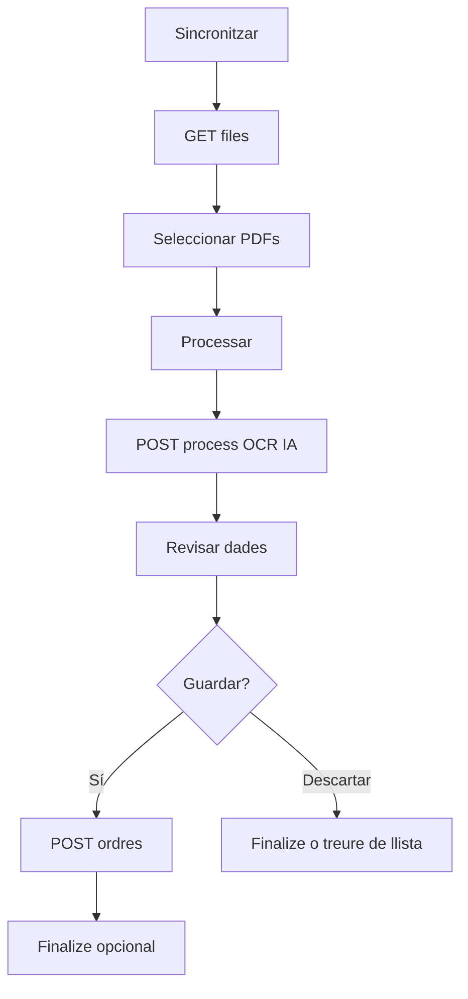

# Documentació tècnica — Frontend WPF

> **Document 4 de 4** · Aplicació d'escriptori  
> Projecte: `Frontend` (`OCRDesktop.csproj`)  
> Framework: .NET 9 · WPF · MVVM (CommunityToolkit.Mvvm)

---

## Índex

1. [Visió general](#1-visió-general)
2. [Estructura del projecte](#2-estructura-del-projecte)
3. [Patró MVVM](#3-patró-mvvm)
4. [Serveis HTTP](#4-serveis-http)
5. [Pestanyes i flux d'usuari](#5-pestanyes-i-flux-dusuari)
6. [Models i mapeig JSON](#6-models-i-mapeig-json)
7. [Comandes principals](#7-comandes-principals)
8. [Execució](#8-execució)

---

## 1. Visió general

El frontend és l'**única interfície d'usuari** del sistema. Permet:

- Sincronitzar i processar PDFs (pestanya **Archivos**).
- Revisar i editar dades extretes pel **servei OCR (IA)**.
- Guardar ordres a través de l'API OCR.
- Llistar ordres pendents i crear pressupostos a Odoo (pestanya **Odoo**).
- Netejar historial de processats (pestanya **Configuración**).

No accedeix directament a SQL Server ni a Odoo: només parla amb les dues APIs HTTP.

| API | Classe | URL base |
|-----|--------|----------|
| Extracció | `OcrApiService` | `http://localhost:5000` |
| ERP | `ErpApiService` | `http://localhost:5100` |

---

## 2. Estructura del projecte

```
Frontend/
├── App.xaml / App.xaml.cs
├── Views/
│   └── MainWindow.xaml          # UI principal (pestanyes)
├── ViewModels/
│   └── MainViewModel.cs         # Lògica i comandes
├── Services/
│   ├── OcrApiService.cs
│   ├── ErpApiService.cs
│   └── Interfaces/
│       ├── IOcrApiService.cs
│       └── IErpApiService.cs
├── Infrastructure/
│   ├── Models/                  # OcrProcessResult, OrderReview, ErpOrdenResumen...
│   ├── OcrOrderMapper.cs        # JSON OCR → OrdresRequest
│   └── OcrJsonOptions.cs
└── Styles/
    └── ModernStyles.xaml
```

---

## 3. Patró MVVM

| Capa | Fitxer | Responsabilitat |
|------|--------|-----------------|
| View | `MainWindow.xaml` | Layout, pestanyes, bindings |
| ViewModel | `MainViewModel.cs` | Estat, comandes (`RelayCommand`), missatges |
| Model | `Infrastructure/Models` | DTOs i objectes observables |
| Serveis | `Services/*` | Crides HTTP |

**Eines:** `CommunityToolkit.Mvvm` (`ObservableObject`, `[ObservableProperty]`, `[RelayCommand]`).

### Propietats d'estat destacades

| Propietat | Ús |
|-----------|-----|
| `Files` | PDFs pendents (`OcrFile`) |
| `Results` | Resultats de processament |
| `CurrentOrderReview` | Dades en edició al popup de revisió |
| `OrdenesOdoo` | Ordres pendents ERP |
| `OrdenOdooSeleccionada` | Ordre seleccionada a la graella |
| `IsBusy` / `StatusMessage` | Feedback a la barra d'estat |
| `SelectedTabIndex` | Pestanya activa (0 Archivos, 1 Odoo, 2 Config) |

---

## 4. Serveis HTTP

### OcrApiService → API OCR (:5000)

| Mètode del servei | HTTP | Endpoint |
|-------------------|------|----------|
| `GetFilesToProcessAsync` | GET | `/OCRservice/files` |
| `ProcessFilesAsync` | POST | `/OCRservice/process` |
| `GetPreviewAsync` | GET | `/OCRservice/preview/{fileName}` |
| `SaveToDbAsync` | POST | `/OCRservice/ordres` |
| `FinalizeProcessAsync` | POST | `/OCRservice/finalize` |
| `ClearHistoryAsync` | DELETE | `/OCRservice/history` |

**Processament:** envia `{ "fileNames": ["..."] }`.

**Guardat:** `OcrOrderMapper` construeix el JSON `OrdresRequest` (snake_case) des de `extractedData` o `OrderReview`.

### ErpApiService → API ERP (:5100)

| Mètode del servei | HTTP | Endpoint |
|-------------------|------|----------|
| `GetOrdenesAsync` | GET | `/erp/ordenes` |
| `CrearPresupuestoAsync` | POST | `/erp/presupuesto` |

**Crear pressupost:** envia `{ "numero_orden": "PO-2024-100" }`.

**Resposta:** deserialitza `ErpPresupuestoResponse` (`message`, `odoo_sale_order_id`, `odoo_sale_order_name`).

Documentació JSON completa: [API OCR](../API_Extraccio/Documentacio_Tecnica.md) · [API ERP](../API_ERP/Documentacio_Tecnica.md).

---

## 5. Pestanyes i flux d'usuari

### Pestanya Archivos



1. **Sincronitzar** — `RefreshCommand` → llista `Files`.
2. **Processar** — `ProcessCommand` → OCR (IA) → `Results`.
3. **Revisar** — `ReviewResultCommand` → obre popup amb `OrderReview`.
4. **Guardar** — `SaveToDbCommand` → `POST /OCRservice/ordres`.
5. **Descartar** — `DiscardResultCommand` → finalize o elimina de la llista.

### Pestanya Odoo

1. **Carregar** — `CargarOrdenesOdooCommand` → `GET /erp/ordenes` → `OrdenesOdoo`.
2. **Seleccionar** fila → `OrdenOdooSeleccionada`.
3. **Crear pressupost** — `CrearPresupuestoEnOdooCommand` → `POST /erp/presupuesto` → MessageBox amb nom Odoo → recarrega llista.

### Pestanya Configuración

- **Esborrar historial** — `ClearHistoryCommand` → `DELETE /OCRservice/history`.

---

## 6. Models i mapeig JSON

### Resultat de processament (`OcrProcessResult`)

Coincideix amb la resposta de l'API OCR:

| Camp | Tipus |
|------|-------|
| `fileName` | string |
| `success` | bool |
| `errorMessage` | string? |
| `jsonPath` | string? |
| `extractedData` | object? |

### Revisió (`OrderReview`)

Model editable amb camps `cliente`, `orden`, `lineas`, `totales` (noms JSON en snake_case via `[JsonPropertyName]`).

### Resum ordre ERP (`ErpOrdenResumen`)

| Camp JSON | Descripció |
|-----------|------------|
| `id` | Guid SQL |
| `numero` | Número d'ordre |
| `fecha` | Data |
| `cliente_nombre` | Nom client |
| `moneda` | EUR, etc. |
| `total_ttc` | Total |
| `lineas` | Comptador de línies |

### OcrOrderMapper

- `ParseExtractedData` — converteix `extractedData` (objecte o `JsonElement`) a `OcrExtractedOrderDto`.
- `ToOrdresApiJson` — genera el JSON per `POST /OCRservice/ordres` incloent `source_file_name`.

---

## 7. Comandes principals

| Comanda | Acció |
|---------|--------|
| `RefreshCommand` | Llista PDFs pendents |
| `SelectAllCommand` | Marca tots els fitxers |
| `ProcessCommand` | Processa seleccionats |
| `ReviewResultCommand` | Obre revisió |
| `SaveToDbCommand` | Guarda a SQL via API |
| `DiscardResultCommand` | Descarta resultat |
| `CargarOrdenesOdooCommand` | Recarrega ordres pendents |
| `CrearPresupuestoEnOdooCommand` | Crea pressupost Odoo |
| `ClearHistoryCommand` | Neteja historial API |

---

## 8. Execució

**Requisits previs:** API OCR (:5000), API ERP (:5100), SQL Server, opcionalment Odoo (:8069) per la pestanya Odoo.

```powershell
cd C:\Users\marcm\Desktop\pf\Frontend
dotnet run
```

**Ordre recomanat d'arrencada:**

1. SQL Server  
2. `docker compose up` a `odoo-projecte` (si cal Odoo)  
3. API OCR  
4. API ERP  
5. Frontend WPF  

Col·locar PDFs a: `API_Extraccio_de_dades/Backend/Storage/ToProcess`.

---

**Enllaços:** [Plantejament](../General/03_Plantejament.md) · [Memòria general](../General/00_Memoria_General.md) · [README documentació](../README.md)
