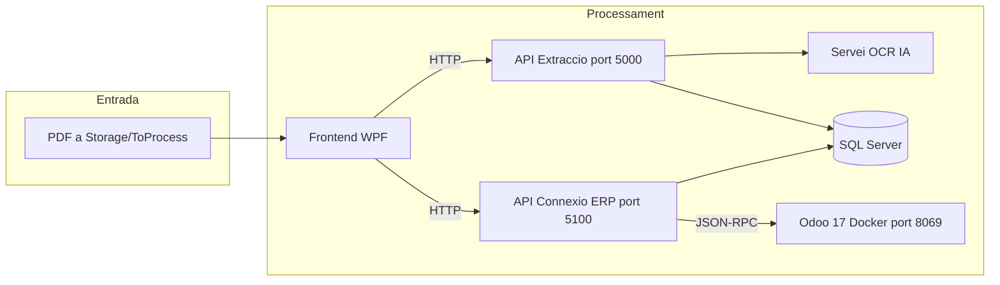

# Plantejament

## 1. Enfocament de la solució

### Problemàtica

En moltes empreses, les ordres de compra arriben en format PDF o en documents no estructurats. Una persona ha de llegir el document i introduir les dades manualment en un sistema intern o en un ERP. Aquest procés consumeix temps, provoca errors i no escala quan augmenta el volum de documents.

### Solució proposada

El projecte proposa un **pipeline semi-automatitzat** amb **revisió humana** en dos punts crítics:

1. Abans de guardar les dades extretes a la base de dades.
2. Abans de crear el pressupost a l'ERP.

El flux parteix d'un PDF, passa per un **servei OCR (IA)** que retorna les dades en format JSON, es validen a una aplicació d'escriptori i es persisteixen a SQL Server. Posteriorment, una API dedicada traspassa l'ordre a **Odoo** com a pressupost de venda.

### Principis de disseny

| Principi | Descripció |
|----------|------------|
| Separació de responsabilitats | La interfície (WPF), l'extracció i persistència (API OCR) i la connexió ERP (API ERP) són components independents. |
| Revisió humana | L'usuari pot corregir les dades abans de confirmar el guardat i abans del traspàs a Odoo. |
| Control d'estat | El camp `estado` de la taula `ordenes` evita crear pressupostos duplicats (0 = pendent, 1 = traspassada). |
| Execució local | Tot el sistema pot executar-se en entorn de desenvolupament; Odoo s'aixeca amb Docker. |

---

## 2. Arquitectura del sistema

### Components

| Component | Ubicació al projecte | Port | Funció |
|-----------|----------------------|------|--------|
| Frontend WPF | `Frontend/` | — | Interfície d'usuari: pestanyes Archivos, Odoo i Configuración |
| API d'extracció de dades | `API_Extraccio_de_dades/Backend/` | 5000 | Gestió de PDFs, crida al servei OCR (IA), validació i guardat a SQL |
| API de connexió ERP | `API_Connecio_ERP/` | 5100 | Consulta d'ordres pendents i creació de pressupostos a Odoo |
| SQL Server | — | — | Emmagatzematge intermedi de clients, ordres i línies |
| Odoo | `odoo-projecte/` (Docker) | 8069 | ERP on es creen els pressupostos (`sale.order`) |

### Per què dues APIs?

- L'**API OCR** combina processament de documents, integració amb el **servei OCR (IA)** i persistència relacional.
- L'**API ERP** encapsula la comunicació JSON-RPC amb Odoo.
- Aquesta separació permet modificar o substituir l'ERP sense alterar el mòdul d'extracció, i manté cada servei amb una responsabilitat clara (requisit no funcional RNF06).

### Estructura interna de l'API OCR

- `Application/Endpoints` — definició dels endpoints HTTP.
- `Business` — lògica de negoci (ordres, proveïdors).
- `Domain` — entitats i validadors de domini.
- `Infrastructure` — DTOs, mappers, accés a dades (ADO).
- `ServiceOCR` — integració amb el servei OCR (IA) i gestió de carpetes `Storage`.
- `Storage/ToProcess` — PDFs pendents de processar.

### Estructura interna de l'API ERP

- `Application/Endpoints` — endpoints `/erp/ordenes` i `/erp/presupuesto`.
- `Business` — creació del pressupost i actualització d'estat.
- `Infrastructure/Integrations/Odoo` — client JSON-RPC.
- `Infrastructure/Persistence` — consultes SQL sobre ordres guardades.

### Estructura del frontend

- `Views/MainWindow.xaml` — pantalla principal amb pestanyes.
- `ViewModels/MainViewModel.cs` — lògica MVVM i comandes.
- `Services/OcrApiService.cs` — client HTTP cap a l'API OCR (port 5000).
- `Services/ErpApiService.cs` — client HTTP cap a l'API ERP (port 5100).
- `Infrastructure/OcrOrderMapper.cs` — transformació del JSON extret al format de l'API.

---

## 3. Flux operatiu complet

| Pas | Actor / component | Acció |
|-----|-------------------|--------|
| 1 | Usuari | Col·loca un PDF a `Storage/ToProcess` |
| 2 | Frontend | `GET /OCRservice/files` — llista documents pendents |
| 3 | Usuari + Frontend | Selecciona fitxer(s) i `POST /OCRservice/process` |
| 4 | API OCR | Envia el PDF al **servei OCR (IA)**; retorna dades estructurades |
| 5 | Usuari | Revisa i corregeix les dades a la pestanya Archivos |
| 6 | Frontend | `POST /OCRservice/ordres` — guarda client, ordre i línies |
| 7 | SQL Server | Ordre registrada amb `estado = 0` (pendent de Odoo) |
| 8 | API OCR | `POST /OCRservice/finalize` — mou el PDF a processats (opcional) |
| 9 | Frontend | Pestanya Odoo: `GET /erp/ordenes` |
| 10 | Usuari | Selecciona ordre i `POST /erp/presupuesto` |
| 11 | API ERP | Llegeix l'ordre completa de SQL Server |
| 12 | Odoo | Es crea o busca el client, es resol el producte i es crea `sale.order` |
| 13 | SQL Server | `estado` passa a `1` |
| 14 | Frontend | L'ordre ja no apareix a la llista de pendents |

Si el guardat falla per validació, l'API pot moure el PDF a la carpeta `Erronies` per facilitar la revisió posterior.

Aquest flux coincideix amb el mapa de processos del projecte (`Documentació/General/Extracció_de_dades.md`).

---

## 4. Model de dades (resum)

La base de dades SQL Server actua com a **punt intermedi** entre l'extracció i l'ERP.

| Taula | Funció |
|-------|--------|
| `clientes` | Dades del client associat a cada ordre |
| `ordenes` | Capçalera de l'ordre, totals, moneda i camp `estado` |
| `lineas_orden` | Línies de producte o servei (descripció, quantitat, preu, codis) |

Relació: un client pot tenir moltes ordres; cada ordre pot tenir moltes línies.

Les relacions entre taules (`clientes` → `ordenes` → `lineas_orden`) es detallen a la memòria general i a la base de dades del projecte.

---

## 5. Integració amb Odoo

L'ERP objectiu del projecte és **Odoo 17**, executat en local mitjançant Docker (`odoo-projecte/docker-compose.yml`).

- **Protocol:** JSON-RPC (`OdooClient.cs`).
- **Entitat creada:** pressupost de venda (`sale.order`).
- **Resolució de producte** (per ordre de prioritat):
  1. Codi de client de la línia (`codigo_cliente`).
  2. Codi de proveïdor de la línia (`codigo_proveedor`).
  3. Producte genèric amb referència interna `SERVICIO`.
  4. Nom exacte de la descripció de la línia.

> **Nota sobre l'empresa col·laboradora:** Bossauto Innova treballa en producció amb **Microsoft Dynamics NAV (Navision)**. Per al projecte acadèmic i les proves s'ha utilitzat **Odoo 17** en local (Docker), **pactat amb l'empresa**, per no interferir amb el sistema real i disposar d'un entorn ERP obert per integrar pressupostos de venda.

---

## 6. Tecnologies utilitzades

| Tecnologia | Justificació |
|------------|--------------|
| .NET 9 + Minimal APIs | APIs lleugeres, tipat fort, documentació Swagger integrada |
| WPF (MVVM) | Aplicació d'escriptori adequada per usuaris d'oficina en Windows |
| SQL Server | Base de dades relacional robusta, alineada amb l'entorn del projecte |
| OCR (IA) | Extracció intel·ligent de dades des de PDFs no estandarditzats |
| Odoo 17 + Docker | ERP obert amb pressupostos de venda; entorn de prova reproducible |

La configuració del servei OCR (IA) i les credencials d'Odoo es defineixen als fitxers `appsettings.json` de cada API i es detallen a la documentació tècnica corresponent.

---

## 7. Abast del sistema

El plantejament cobreix:

- Lectura i processament de PDFs des d'una carpeta local de treball.
- Extracció de dades mitjançant **OCR (IA)** amb revisió prèvia per l'usuari.
- Emmagatzematge estructurat a SQL Server.
- Creació d'un pressupost de venda a Odoo per cada ordre validada.
- Control del cicle de vida de l'ordre mitjançant el camp `estado`.

---

## Documentació relacionada

| Document | Descripció |
|----------|------------|
| [Índex general](../README.md) | Mapa dels 4 documents |
| [Memòria general](00_Memoria_General.md) | Introducció, empresa, conclusions |
| [Documentació tècnica API OCR](../API_Extraccio/Documentacio_Tecnica.md) | Endpoints i JSON 100% |
| [Documentació tècnica API ERP](../API_ERP/Documentacio_Tecnica.md) | Endpoints i Odoo |
| [Documentació tècnica Frontend](../Frontend/Documentacio_Tecnica.md) | WPF, MVVM, pestanyes |

